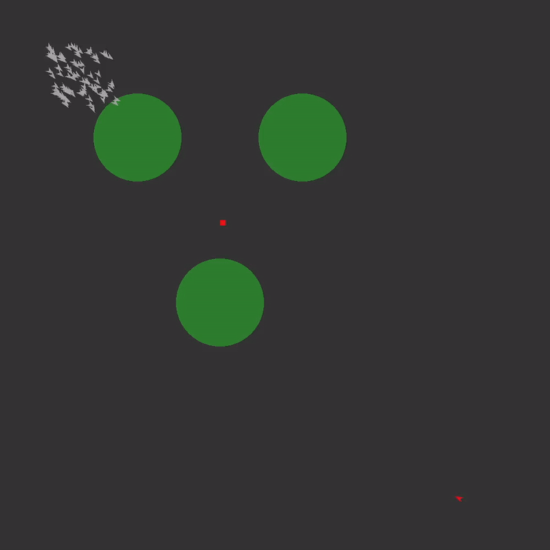

# rust-flock-of-boids
## Description
A fork of camsjams/rust-flock-of-boids designed to replicate an existing swarm and target problem written in java. 

A swarm of boids moves between waypoints in a bounded environment. An independent agent acts ad-hoc with limited knowledge other than the positive and negative stimuli provided from the target and swarm respectively. The agent only knows these stimuli if it can simulate reaching them, and based on these simulations must take actions assumed to help it reach the target.

## Platforms / Technologies
* [Rust](https://www.rust-lang.org/en-US/)
* [Piston](https://www.piston.rs/)

## Run
>      $ cargo run --bin with_piston

## Build For Release
>      $ cargo build --bin with_piston --release

## Example: Monte-Carlo Rollouts

## Entity Relationships
